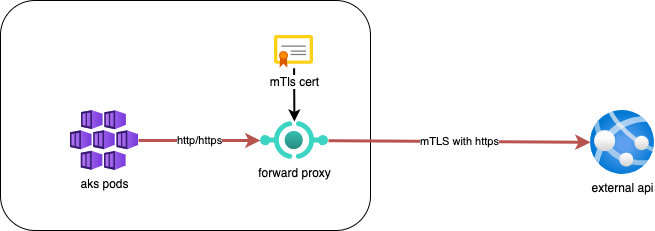

# drunk-nginx-proxy Chart

[](https://helm.sh/)

This Helm chart facilitates the deployment of an nginx-proxy that acts as a forward proxy. The proxy is designed to enable internal services within your Kubernetes cluster to securely communicate with external services using mutual TLS (mTLS) authentication. By leveraging nginx's robust capabilities, the chart provides configuration options to specify target hosts, paths, and the necessary mTLS credentials. This forward proxy setup not only ensures encrypted communication but also validates both parties' authenticity, providing an additional layer of security for your webhooks and web applications.



## Table of Contents

- [drunk-nginx-proxy Chart](#drunk-nginx-proxy-chart)
  - [Table of Contents](#table-of-contents)
  - [Introduction](#introduction)
  - [Prerequisites](#prerequisites)
  - [Installation](#installation)
  - [Parameters](#parameters)
  - [Usage](#usage)
  - [Contributing](#contributing)
  - [License](#license)
    - [Thanks](#thanks)

## Introduction

This Helm chart deploys the **nginx-proxy**.

## Prerequisites

- Kubernetes 1.19+
- Helm 3.0+
- A running Kubernetes cluster
- `kubectl` configured to access your Kubernetes cluster

## Installation

To install the chart with the release name `drunk-nginx-proxy`, follow these steps:

1. Add the Helm repository (if needed):

   ```bash
   helm repo add drunk-nginx-proxy https://baoduy.github.io/drunk.charts/drunk-nginx-proxy
   helm repo update
   ```

2. Install the chart:
   ```bash
   helm install drunk-nginx-proxy drunk-nginx-proxy/drunk-nginx-proxy
   ```

## Parameters

The following table lists the configurable parameters of the `drunk-nginx-proxy` chart and their default values in `values.test.yaml`.

| Parameter                            | Description                            | Default          | Type    |
| ------------------------------------ | -------------------------------------- | ---------------- | ------- |
| `proxies.webhook.enabled`            | Enable webhook proxy                   | `false`          | boolean |
| `proxies.webhook.ingressHost`        | Host for webhook ingress               | `localhost`      | string  |
| `proxies.webhook.ingressPath`        | Path for webhook ingress               | `/webhook/?(.*)` | string  |
| `proxies.webhook.target`             | Target IP address for webhook          | `192.168.1.68`   | string  |
| `proxies.webhook.targetMTlsCert.ca`  | CA certificate for webhook backend TLS | `123`            | string  |
| `proxies.webhook.targetMTlsCert.crt` | Certificate for webhook backend TLS    | `444`            | string  |
| `proxies.webhook.targetMTlsCert.key` | Key for webhook backend TLS            | `555`            | string  |
| `proxies.webapp.ingressHost`         | Host for webapp ingress                | `api.dev.local`  | string  |
| `proxies.webapp.ingressPath`         | Path for webapp ingress                | `/webapp/?(.*)`  | string  |
| `proxies.webapp.target`              | Target service for webapp              | `webhook.site`   | string  |
| `proxies.webapp.targetPort`          | Target port for webapp                 | `443`            | int     |
| `proxies.webapp.ingressTlsSecret`    | TLS secret name for the webapp         | `tls-dev-local`  | string  |

## Usage

Please refer the [`values.test.yaml`](values.test.yaml) for details.

## Contributing

Contributions are welcome!. For any questions or issues, please open an issue in the project's GitHub repository.

## License

This project is licensed under the MIT License.

### Thanks

[Steven Hoang](https://drunkcoding.net)
